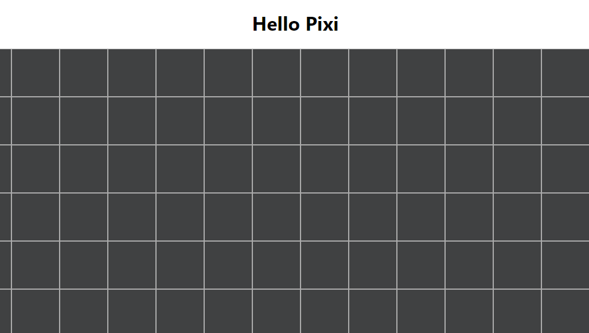

# PixiHook

A react hook library for the 2D engine [PixiJs](https://pixijs.io/)

# Installing

Using npm:

```bash
$ npm install pixihook
```

Using yarn:

```bash
$ yarn add pixihook
```

# Example

```typescript
const Component = () => {
    const { app, Pixi } = usePixi({
        width: window.innerWidth,
        height: window.innerHeight,
        containerId: 'pixiContainer',
        backgroundColor: 0x404142,
        antialias: true
    });

    const graphics = new PIXI.Graphics();

    const setup = () => {
        graphics.x = 0;
        graphics.y = 0;
    }

    const drawGrid = () => {
        graphics.lineStyle(2, 0xaaaaaa);

        for (let i = 0; i < 100; i++) {
            graphics.moveTo(0, i * 80);
            graphics.lineTo(window.innerWidth, i * 80);
        }

        for (let i = 0; i < 100; i++) {
            graphics.moveTo(i * 80, 0);
            graphics.lineTo(i * 80, window.innerHeight);
        }
    }

    setup();

    app.ticker.add(() => {
        graphics.clear();
        drawGrid();  
    });

    app.stage.addChild(graphics);

    return (
        <div>
            <h1 style={{ textAlign: 'center' }}>Hello Pixi</h1>
            <div id="pixiContainer" />
        </div>
    )
}
```

Result:


# License
MIT
